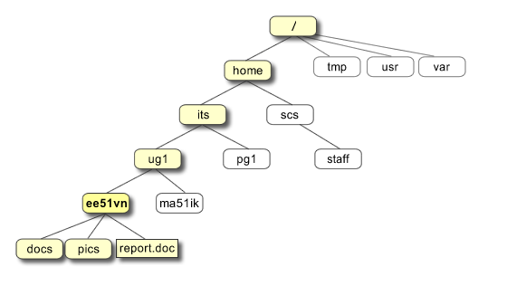

* 输入单元
* 主机部分
* 输出单元

three parts:
* kernel
* shell
* program

> the kernel of UNIX is the hub of the operating system.

> the shell acts as an interface between the user and the kernel

---
> Everything in UNIX is either a file or a process.

* process

A process is an executing program identified by a unique PID(process identifier)

* file

A file is a collection of data. They are created by user using text editors, running compilers.

File

---

> 目录操作

`cd #`                回到主目录

`cd ~`                回到主目录

`cd %HOME`       回到主目录

`cd -`                 回到上次所在目录

`cd !$ `               把上个命令的参数做为输入

`cd .. `               回到上层目录

`cd` return home-directory

---

`ls` 查看当前目录下的所有文件，不是以 `.` 开头的

`ls -a` 查看所有文件

---

> Directory

`mkdir` make Directory

`cd` change Directory

在应用 `ls -a` 命令后，会有两个

* `.` the current Directory
* `..` the parent Directory

`pwd` print working Directory

> 复制

`cp` copy

`cp file1 file2` 把当前目录的 file1 复制到当前目录并保存为 file2

> 移动

`mv` move

`mv file1 file2`

> 删除

`rm` remove

`rmdir` remove directory

> 清除命令窗口

`clear` clear screen

---

> 创建 txt 文件

`touch name.txt`

> 显示文件内容

`cat science.txt`

---
`*` will match against none or more characters in a file name.

`?` list all files in the curren directory endind with ....list

---
> acces rights

`ls -l`

`ls -lg`

---

> `chmod` changing a file mode

Symbol	Meaning

u  user

g group

o other

a all

r read

w write (and delete)

x execute (and access directory)

`+` add permission

`-` take away permission

---

> processes and jobs

A process is an executing program identified by a unique PID

`% ps`

> 编译原理

Steps to install the software

1. Locate and download the source code

2. Unpack the source code

3. Compile the code

4. Install the resulting executable

5. Set paths to the installation directory

Compiling Source Code

* C language
* assembly language
* object code
* link the object code into code libraries
* produce an executable program

> Compiling UNIX software packages

> g++ 常用命令

选项	选项描述

-c	只对文件进行编译和汇编，但不进行连接，生成目标文件”.o”

-S	只对文件进行编译，但不汇编和连接

-E	只对文件进行预处理，但不编译汇编和连接

-g	在可执行程序中包含标准调试信息

-o file1 [file2]	将文件file1编译成可执行文件file2

-v	打印出编译器内部编译各过程的命令行信息和编译器的版本

-I dir	在头文件的搜索路径列表中添加dir目录

-L dir	在库文件的搜索路径列表中添加dir目录

-static	强制链接静态库

-lNAME	连接名为libNAME的库文件

-Wall -W	开启GCC最常用的警告，GCC的warning一般格
式为file:line-number:message

-pedantic	要求严格符合ANSI标准

-Wconversion	开启隐式类型转换警告

-Wshadow	开启同名变量函数警告

-Wcast-qual	开启对特性移除的cast的警告，如const

-O(-O1)	对编译出的代码进行优化

-O2	进行比-O高一级的优化

-O3	产生更高级别的优化

-Os	产生最小的可执行文件

-pg	开启性能测试，记录每个函数的调用次数与时长

-ftest-coverage	记录每一行被执行的次数

-fprofile-arcs	记录每个分支语句执行的频率

> 文件权限与目录配置

文件可存取的身份分为三个类别： owner or user/group/others

拥有者/群组/

`chgrp` 改变文件所属群组
`chown` 改变文件拥有者
`chmod` 改变文件的权限
