# Controller Area Network

> Bosch 为解决现代汽车中众多控制单元，测试仪器之间的实时数据交换而开发的一种串行通信协议。

传统的汽车线束连接：

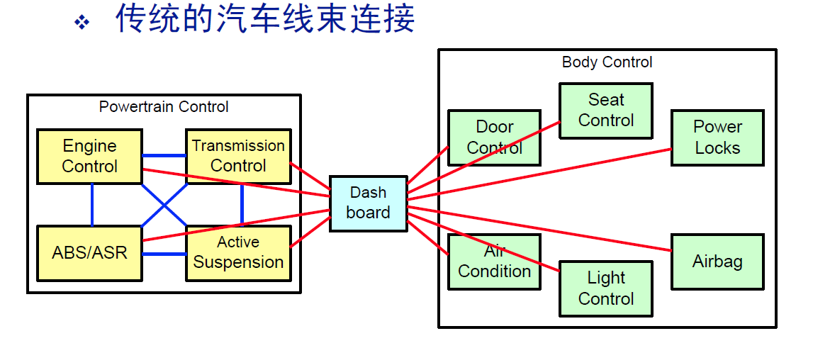

汽车的 CAN 网络：

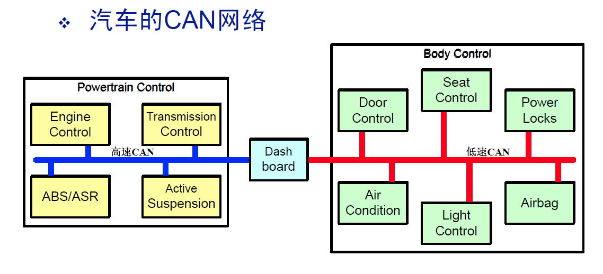

> CAN 的特性

* 采用双线差分信号

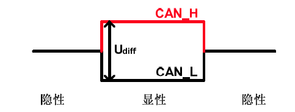

* 协议本身对节点的数量没有限制，总线上节点的数量是可以动态改变

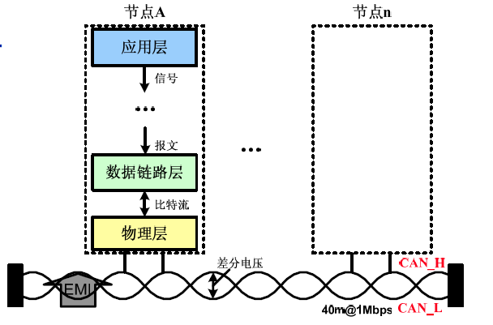

* 广播发送报文，报文可以被所有节点同时接收
* 多主站结构，各节点平等，优先权由报文 ID 确定
* 每个报文的内容通过标识符识别，标识符在网络中是唯一的
* 根据需要可以进行相关性的报文过滤

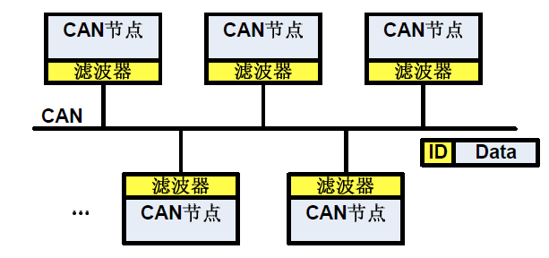

*  保证系统数据一致性， CAN 提供了一套复杂的错误检测与错误处理机制

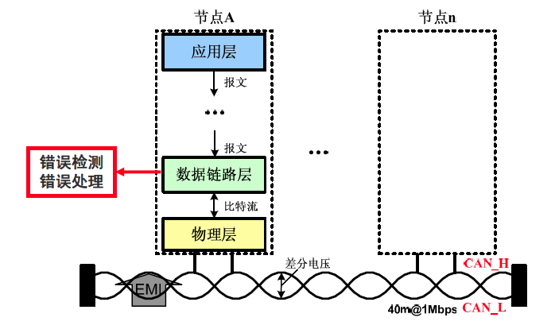

* 使用双绞线作为总线介质，传输速率可以达到 1Mbps， 总线长度 <= 40 米。

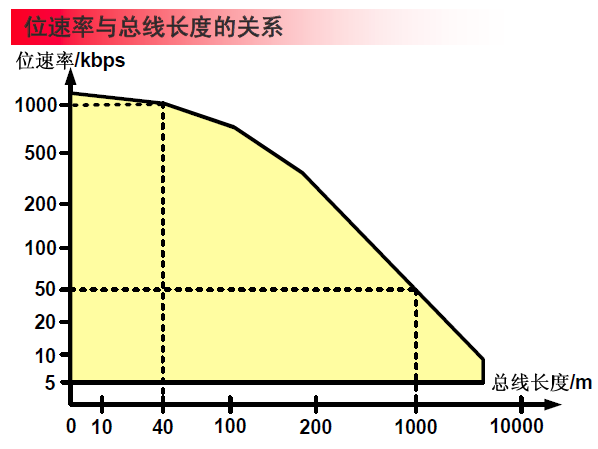

* 采用 NRZ 和 位填充的位编码方式

> 汽车总线的分类

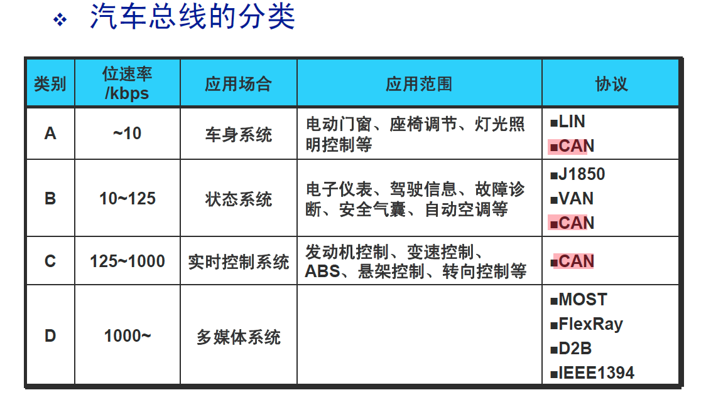

> CAN 总线的应用

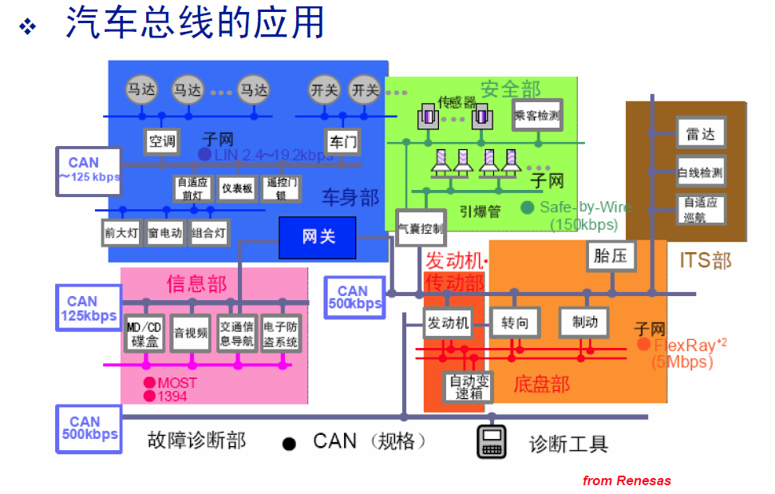

> CAN 2.0 版本

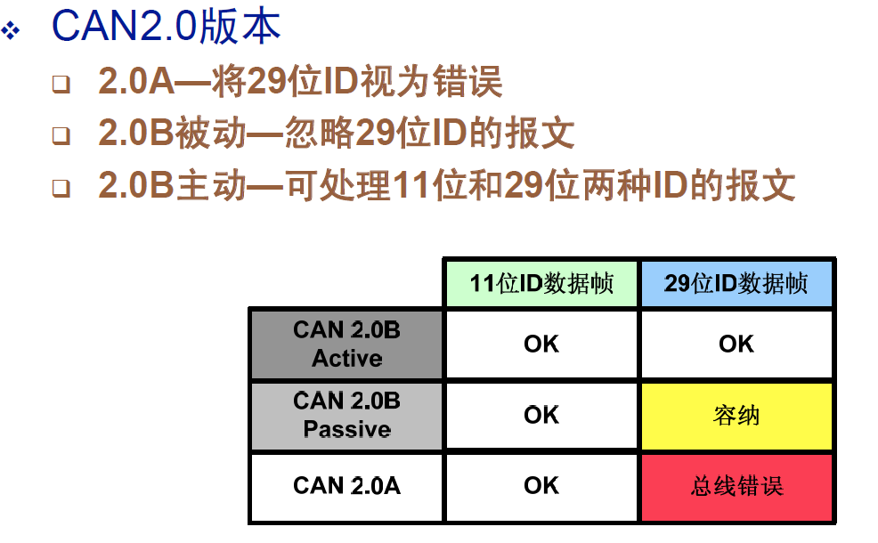

> 五种类型的帧

* 数据帧

用于发送单元向接收单元传输数据的帧

* 远程帧

用于接收单元向具有相同 ID 的发送单元请求数据的帧

* 错误帧

用于当检测出错误时，向其他单元通知错误的帧

* 超载帧

用于接收单元通知其尚未做好接收准备的帧

* 帧间隔

用于将数据帧及遥控帧与前面的帧分离开来的帧

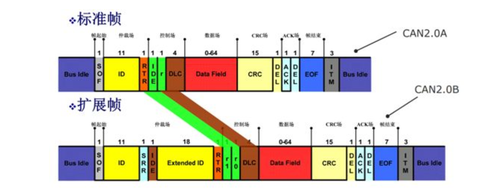

DLC Data Length Code
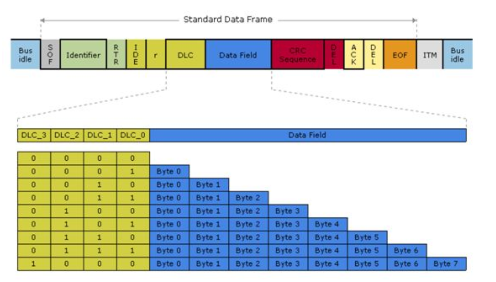

> DBC 文件

DBC 文件是用来描述 CAN 网络中

DBC file is a proprietary format that describes the data over a CAN bus.
